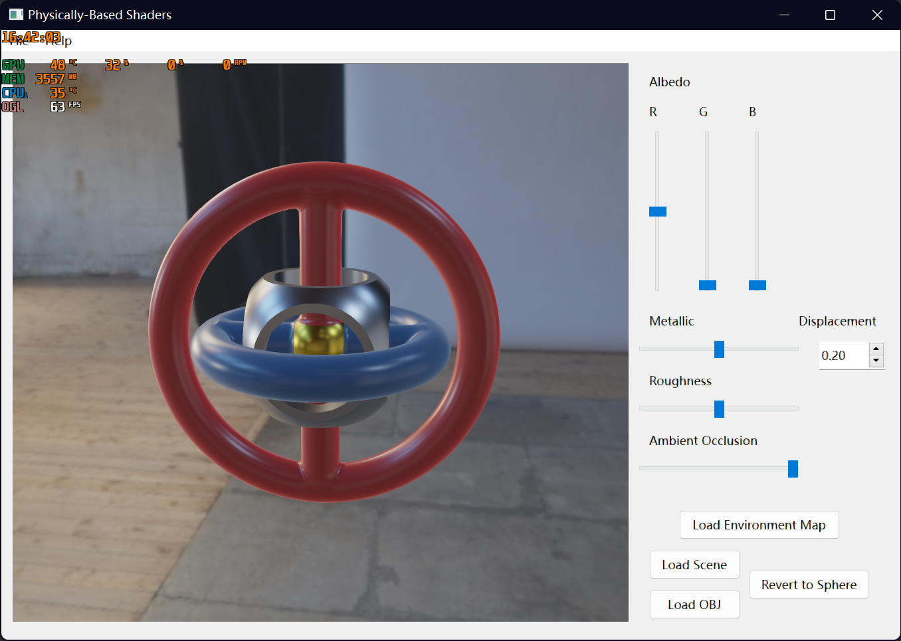
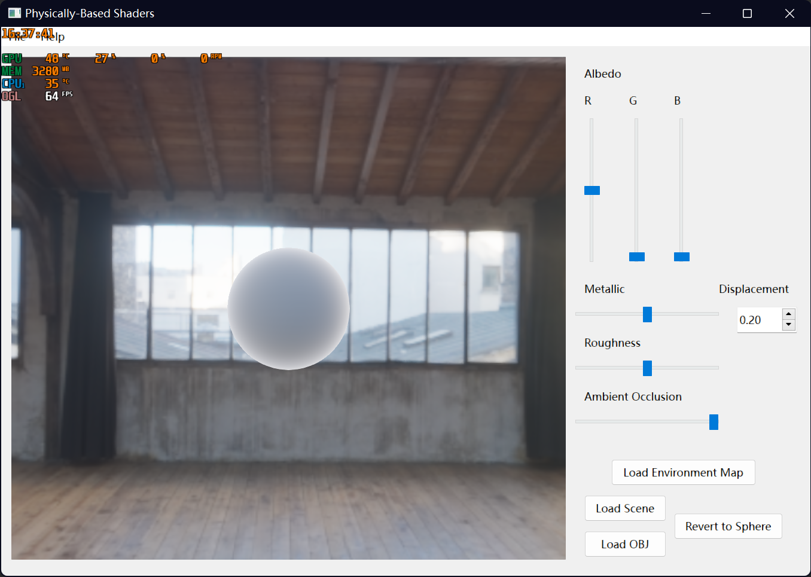
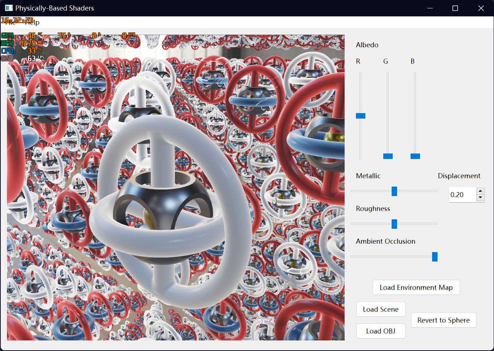

**University of Pennsylvania, Raymarching**

* Yilin Li

## Introduction 
Implemented subsurface scattering and raymarching on top of physically-based shader. 

Some scenes are shown below:

## How to Open 
1. Clone the project.
2. Go to folder assignment_package and open `pbrShaderSDFs` with Qt.
3. Enjoy the shader.
